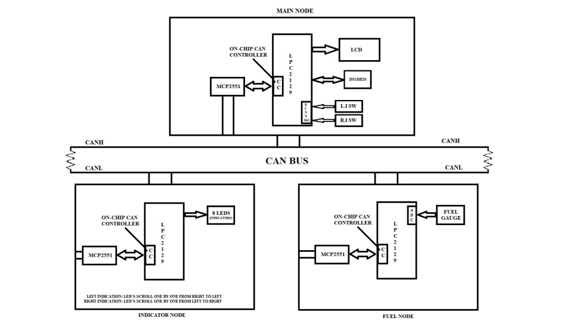

# Dashboard Design using CAN Bus

This project demonstrates a **dashboard system for automotive applications** using the **CAN (Controller Area Network) protocol**. It displays vital vehicle data such as **engine temperature**, **fuel level**, **indicator signals**, and **real-time clock (RTC)** information via a distributed embedded network.

## 🧠 Project Overview

The main objectives of this project are to:

- Display **engine temperature** using a digital sensor
- Display **fuel percentage** via ADC
- Indicate **left and right turns** using LEDs
- Show **real-time clock (time, date, day)**
- Communicate data across different modules using the **CAN protocol**

## 📦 Hardware Requirements

- **LPC2129 Microcontroller**
- **CAN Transceiver (MCP2551)**
- **LCD Display**
- **LEDs** (for indicator signals)
- **Switches** (to simulate indicator actions)
- **DS18B20 Temperature Sensor**
- **Fuel Gauge**

## 💻 Software Requirements

- **Embedded C Programming**
- **Keil uVision (C Compiler)**
- **Flash Magic** (for flashing code onto microcontroller)

## 🛠️ System Architecture

The system is composed of **three CAN nodes**:

1. **Main Node**
   - Reads engine temperature using **DS18B20 sensor**
   - Displays **temperature, fuel level, indicator status, and RTC** on an **LCD**
   - Sends **indicator commands** to the Indicator Node
   - Receives **fuel level data** from the Fuel Node
   - Continuously updates and displays **time/date/day** via RTC

2. **Fuel Node**
   - Reads analog **fuel gauge** using on-chip ADC
   - Sends **fuel percentage data** to the Main Node over CAN

3. **Indicator Node**
   - Receives commands from Main Node via CAN
   - Controls **left and right indicator LEDs** accordingly

## 🔁 Implementation Steps

1. Create a working folder and organize project files
2. Test each hardware component individually:
   - **LCD**: Display static and dynamic content
   - **ADC**: Read voltage from fuel sensor
   - **Temperature Sensor (DS18B20)**: Read and display engine temperature
   - **RTC Module**: Display time, date, and day
   - **External Interrupts**: Test EINT0 & EINT1 for indicator simulation
   - **CAN Communication**: Use sample CAN code for initial testing

3. Integrate the modules:
   - **Main Node**:
     - Reads data from sensors
     - Sends/receives CAN messages
     - Displays everything on LCD
   - **Fuel Node**:
     - Sends periodic fuel level data
   - **Indicator Node**:
     - Responds to interrupt-triggered CAN messages from the main node

## 🖼️ Block Diagram

## ✅ Completion Criteria

The project is considered complete if:

- **Engine temperature**, **fuel level**, and **RTC** data are shown on the LCD
- **Left/right indicator LEDs** are controlled via interrupts and reflect on the LCD
- CAN-based **communication between all nodes** is successful and responsive

